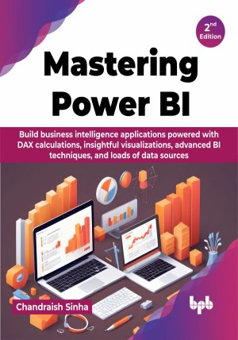

# Mastering Power BI - 2nd Edition

Take a deep dive into the dynamic world of Power BI!

This is the repository for [Mastering Power BI - 2nd Edition
](https://bpbonline.com/products/mastering-power-bi-2nd-edition),published by BPB Publications.

## About the Book
Mastering Power BI covers the entire Power BI implementation process. The readers will be able to understand all the concepts covered in this book, from data modeling to creating powerful visualizations.

This book begins with concepts and terminology such as the star-schema, dimensions, and facts. It explains multi-table dataset and demonstrates how to load these tables into Power BI. It shows how to load stored data in various formats and create relationships. Readers will also learn more about Data Analysis Expressions (DAX). This book is a must for developers to learn how to extend the usability of Power BI, to explore meaningful and hidden data insights. Throughout the book, you keep on learning about the concepts, techniques, and expert practices on loading and shaping data, visualization design, and security implementation.

The second edition of Mastering Power BI book adheres to the first edition in terms of providing the basics of business intelligence and Power BI; however, it introduces new concepts and features in terms of data transformation, data profiling, custom hierarchies, AI visuals, and many more. 

## What You Will Learn
• Learn about Business Intelligence (BI) concepts and their contribution in business analytics.

• Learn to connect, load, and transform data from disparate data sources.

• Create and execute powerful DAX calculations.

• Design various visualizations to prepare insightful reports and dashboards. 
